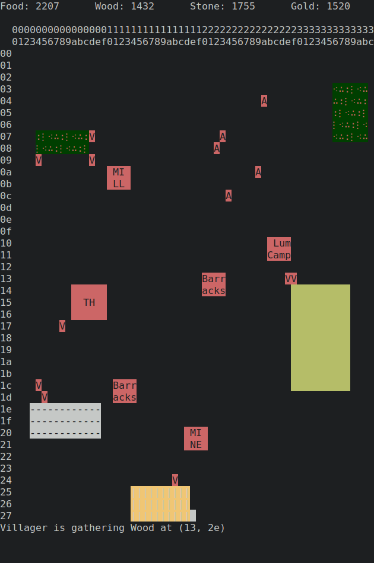

# Command Line and Conquer
Winner of Best Game at the 2022 University of Queensland Computing Society Hackathon

## Concept
Command Line and Conquer was originally envisioned as a version of age of empires that can be played
from the terminal. However, none of the development team had played age of empires in a few years and thus as a 
consequence of our foggy memories Command Line and Conquer quickly diverged from its source material and became
the fast-paced actions-per-minute rewarding game that it is today. 

<table><tr>
<td>  </td>
<td>  </td>
</tr></table>

## Set Up
### Dependencies
- python3.10.10

### Running
The game can be played by cloning this repository
```bash
git clone https://github.com/antdon/TAOE
```
And running the run.py file
```bash
./run.py
```

# How to Play
The player interacts with the game entirely through text input. Commands were made to emulate the feel 
of interacting with a bash command line so the basic structure is 
```
(unit||Structure)/(command) [args]
```
Commands do not stack! If a unit or structure has not finished executing a command before you give it its next command
it will interrupt the command it is executing in order to complete the new command.
Below is a list of commands currently implemented

## Commands
All Units and structures can be accessed either through their name i.e `villager` or by their name followed by their index i.e `villager4`. The former will assume the index of 0.
### Villager
```
villager0/gather (food | stone | gold | wood)
```
```
villager0/build (barracks | mill | lumbercamp | mine) y x
```
```
villager0/move  y x
```

### Soldier, Archer and Cavalry
All soldier type units have the same commands associated with them
```
soldier0/attack (villager | soldier | archer | cavalry)
```
```
soldier0/move y x
```

### Townhall
```
townhall0/create villager
```

### Barracks
```
barracks0/create (soldier | archer | cavalry)
```

### Resource structures
Resource structures do not have any commands associated with them. When a villager collects a resource they
normally need to return to the townhall in order for that resource to be added to the players inventory. Resource
structures allow for a specific resource to be returned to the resource structure instead. 
Below is a list of resource structures and their associated resource
- mill - food
- lumbercamp - wood
- mine - Gold or Stone